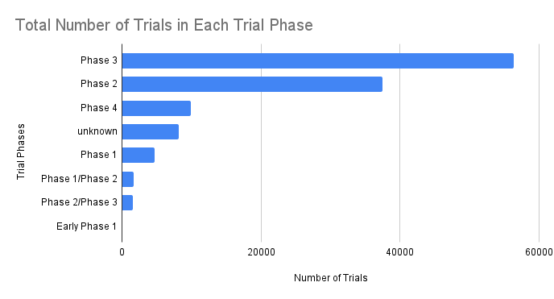

# clinical-trial-efficacy-sql-analysis
This project analyzes publicly available clinical trial efficacy data to examine enrollment patterns, data completeness, and trial phases. SQL was used to aggregate trial characteristics, identify missing or inconsistent fields, and summarize trends across studies.

# Clinical Trial Efficacy Analysis (SQL Project)

## Project Overview
This project analyzes clinical trial efficacy data using SQLite to evaluate trial distribution, enrollment trends, and data quality.

The goal was to demonstrate SQL proficiency in:
- Data aggregation
- Handling missing values
- Grouping and summarizing categorical variables
- Calculating percentages
- Clinical data interpretation

---

## Dataset
Clinical Trial Efficacy Results Dataset  
Source: Public clinical trial registry data (CSV format)

---

## Key Questions Explored

1. How many trials are in each phase?
2. What is the average enrollment by phase?
3. What percentage of enrollment data is missing?
4. What Conditions are being researched in each trial phase?
5. Who funds the most trials?
6. Data completeness assessment.

---

## Key Findings

- Enrollment data was highly complete (~0.03% missing).
- Certain trial phases show significantly higher average enrollment.
- Most trials fall within Phase II and Phase III categories.
- %99.97 of the trials provided completed enrollment data.
- Top 10 trial funders.

---

## Visualizations

### Trials by Phase

### Average Enrollment by Phase

---

## Tools Used
- SQLite
- SQL (aggregation, CASE, COALESCE, GROUP BY, percentage calculations)
- Google Sheets (visualization)
- GitHub (project documentation)

---

## Skills Demonstrated
- Clinical data analysis
- SQL data cleaning and transformation
- Missing data handling
- Analytical reporting
- Data visualization
